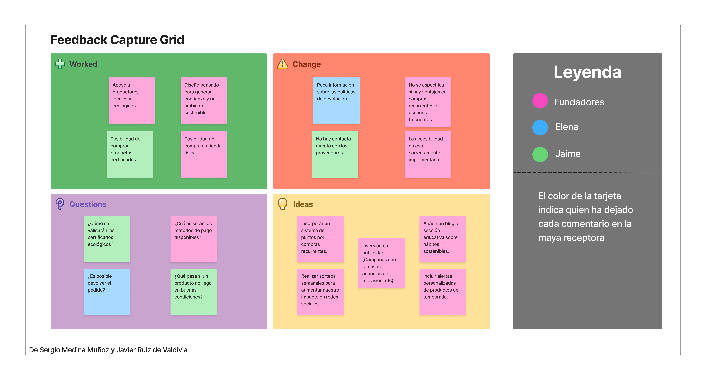
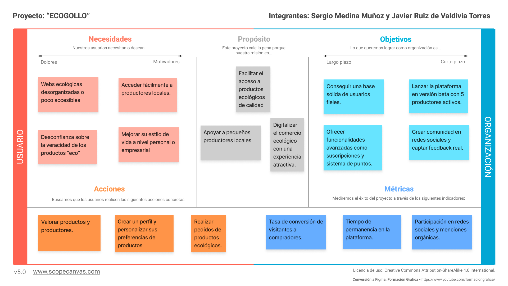

## DIU - Practica2, entregables

### Ideación 
* Malla receptora de información
  
  
* Mapa de empatía

### PROPUESTA DE VALOR
Proponemos desarrollar una página web para la venta/compra de productos ecológicos. Esta web te dejará crear una cuenta como comprador y otra cuenta como productor si lo que deseas es vender, el usuario tendrá un apartado llamado Mi Cuenta para editar su perfil, ver su historial de compras, sus pedidos en curso y valorar los productos comprados y sus productores. podrá crear y editar su carrito de la compra con productos que encuentre en el buscador, en el propio buscador podrá elegir la búsqueda por categorías, dejando a su vez añadir a favoritos las categorías que prefiera. El productor podrá añadir nuevos productos y gestionarlos.
* ScopeCanvas

### TASK ANALYSIS

* User Task Matrix
| TAREA                                   | Visitante | Usuario registrado | Productor  | Administrador |
|-----------------------------------------|-----------|--------------------|------------|---------------|
| Buscar productos                        | H         | H                  | M          | L             | 
| Ver detalles de un producto             | M         | H                  | M          | M             | 
| Iniciar Sesión                          | -         | H                  | H          | H             | 
| Filtrar productos por categoría         | M         | H                  | L          | L             | 
| Ver pedidos en curso                    | -         | M                  | M          | L             | 
| Añadir nuevos productos                 | -         | -                  | H          | M             | 
| Gestionar productos                     | -         | -                  | H          | M             | 
| Analizar métricas y ventas              | -         | -                  | M          | H             | 
| Contactar con productor o cliente       | -         | L                  | L          | M             | 
| Registrarse                             | H         | -                  | -          | -             | 
| Añadir producto al carrito              | -         | H                  | -          | -             | 
| Realizar pedido(comprar carrito)        | -         | H                  | -          | -             | 
| Valorar producto/productor              | -         | M                  | -          | L             | 
| Historial de compras                    | -         | M                  | -          | L             | 
| Revisar y aprobar productos             | -         | -                  | -          | H             | 
| Gestionar cuentas de usuario            | -         | -                  | -          | H             | 
| Devolver pedido                         | -         | L                  | -          | -             |

Leyenda: H = Alta prioridad / M = Media / L = Baja / - = No disponible para ese rol

* User/Task flow

### ARQUITECTURA DE INFORMACIÓN

* Sitemap 
* Labelling 

### Prototipo Lo-FI Wireframe 

### Conclusiones  
(incluye valoración de esta etapa)

>>>> Este fichero se debe editar para que cada evidencia quede enlazada con el recurso subido a la carpeta de la practica. Se pide más detalle técnico en las descripciones de lo que sería el README principal del repositorio y que corresponde a la descripcion del Case Study.
>>>> Termine con la seccion de Conclusiones para aportar una valoración final del equipo sobre la propia realización de la práctica
