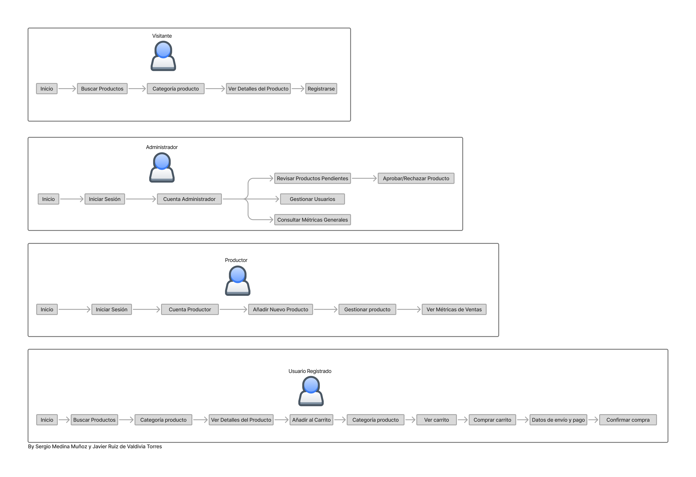

## DIU - Practica2, entregables

### Ideación 
* Malla receptora de información
  
  
* Mapa de empatía

### PROPUESTA DE VALOR
Proponemos desarrollar una página web para la venta/compra de productos ecológicos. Esta web te dejará crear una cuenta como comprador y otra cuenta como productor si lo que deseas es vender, el usuario tendrá un apartado llamado Mi Cuenta para editar su perfil, ver su historial de compras, sus pedidos en curso y valorar los productos comprados y sus productores, a la vez que puede hacer devoluciones y contactar con el productor de un producto en específico, poodrá crear y editar su carrito de la compra con productos que encuentre en el buscador, en el propio buscador podrá elegir la búsqueda por categorías, dejando a su vez añadir a favoritos las categorías que prefiera. El productor podrá añadir nuevos productos y gestionarlos. (Dar recompensas por comprar en la web es una implementación a futuro, de momento queremos centrarnos en las funciones necesarias para la página web)
* ScopeCanvas

### TASK ANALYSIS

* User Task Matrix
  
| TAREA                                   | Visitante | Usuario registrado | Productor  | Administrador |
|-----------------------------------------|-----------|--------------------|------------|---------------|
| Buscar productos                        | H         | H                  | M          | L             | 
| Ver detalles de un producto             | M         | H                  | M          | M             | 
| Iniciar Sesión                          | -         | H                  | H          | H             | 
| Filtrar productos por categoría         | M         | H                  | L          | L             | 
| Analizar métricas y ventas              | -         | -                  | H          | H             |
| Ver pedidos en curso                    | -         | M                  | M          | L             | 
| Añadir nuevos productos                 | -         | -                  | H          | M             | 
| Gestionar productos                     | -         | -                  | H          | M             |  
| Contactar con productor o cliente       | -         | L                  | L          | M             | 
| Registrarse                             | H         | -                  | -          | -             | 
| Añadir producto al carrito              | -         | H                  | -          | -             | 
| Realizar pedido(comprar carrito)        | -         | H                  | -          | -             | 
| Valorar producto/productor              | -         | M                  | -          | L             | 
| Historial de compras                    | -         | M                  | -          | L             | 
| Revisar y aprobar productos             | -         | -                  | -          | H             | 
| Gestionar cuentas de usuario            | -         | -                  | -          | H             | 
| Devolver pedido                         | -         | L                  | -          | L             |

Leyenda: H = Alta prioridad / M = Media / L = Baja / - = No disponible para ese rol

* User/Task flow

### ARQUITECTURA DE INFORMACIÓN

* Sitemap
  
* Labelling
  

### Prototipo Lo-FI Wireframe 
Hemos creado los prototipos Lo-FI responsive de posiblemente las 3 páginas que más vayan a usar tanto los visitantes como los usuarios registrados.

#### Bocetos Inicio
  * Para PC/tablet/movil:
    
    
    
  
#### Bocetos Buscar Productos
  * Para PC/tablet/movil:
    
    
    
  
#### Bocetos Detalles producto
  * Para PC/tablet/movil:
    
    
    

### Conclusiones  
En esta etapa hemos definido el camino que va a tomar nuestro proyecto añadiendo a su vez algunas ideas para incorporar a futuro, pero actualmente proponiendo una funcionalidad cliente/productor sencilla para cualquier persona.

Hemos añadido el apartado de devolver pedido, que es algo que no hemos visto con facilidad en otros lugares de este mismo sector de la misma manera que una comunicación con el usuario y productor más sencilla. Otra implementación es poder ver a tiempo real por dónde va el pedido realizado, algo que funciona bien en otras webs, pero en este sector no hemos visto.

En definitiva, hemos querido aportar una web sencilla sin muchas florituras ni botones para que cualquier persona pueda navegar cómodamente sin perderse y sin saturarse, añadiendo la opción de favoritos para encontrar tu categoría rápidamente y, por ejemplo, en el propio apartado Mi Cuenta, puedes acceder tanto a tu perfil, como al historial de compras y pedidos en curso sin necesidad de que te dirija a otra página.

