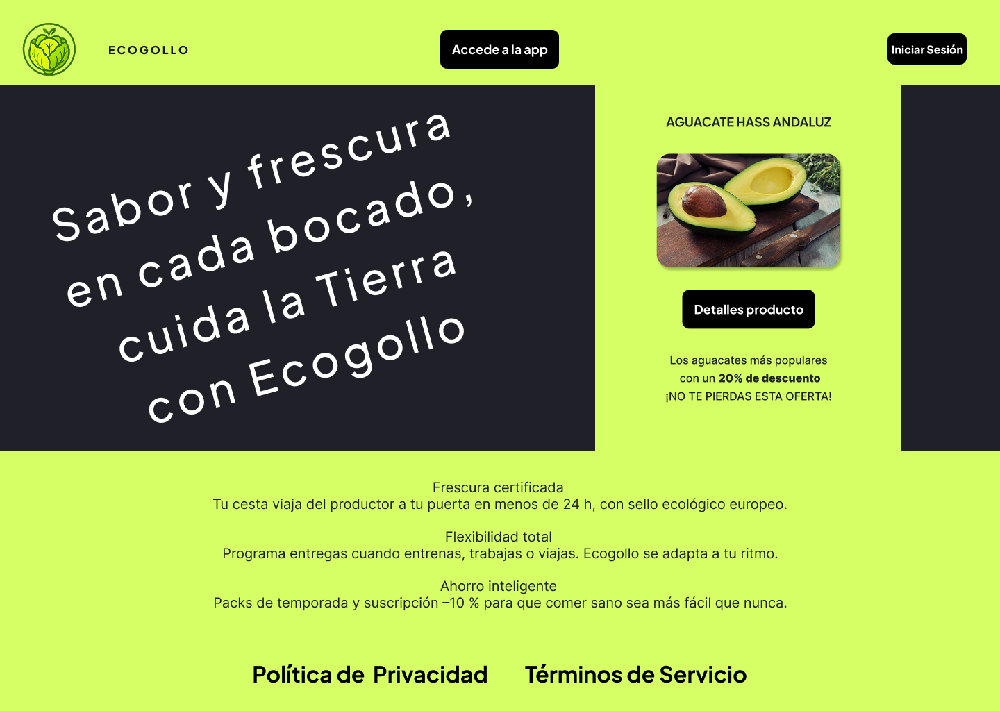

# DIU - Practica 3, entregables

## Moodboard (diseño visual + logotipo)

- Con respecto a la paleta de colores sentimos que el contraste es óptimo para el ojo humano, testeado con otras personas para conocer opiniones.  
  En cuanto al color primario en modo normal tenemos `#D6FF65` y como color secundario `#1F2028`, color que podemos ver en los encuadres de cada producto,  
  en el texto y en la Landing Page.  
  Color primario del modo noche: `#1F2028` y color secundario: `#DDDDDD`.

- En cuanto al tamaño del tipo de letra para el texto (**Inter**), solemos usar tamaño `16`,  
  pero en detalles de producto usamos tamaño `20` para una visión mucho más clara de todo lo que ofrece el producto.  
  Para el tamaño del título de las páginas (**Plus Jakarta Sans**) usamos tamaño `24`,  
  y para el título de cada producto, tamaño `18`.

- Resto de información en el moodboard:
  
  
  
## Landing Page

- Uso de fuentes, paleta de colores, slogan e iconos definidos en el Moodboard.

- Hay llamadas a la acción para:
  - Acceder a la propia app en la que se basa nuestro mockup.
  - Iniciar sesión (dentro se encuentra también el registro para nuevos usuarios).
  - Ver los detalles del producto más popular de la página.

- El archivo de Figma incluye interacción en el botón **"Accede a la app"**,  
  el cual redirige al mockup de layout HI-FI en Figma.
  
  

## Guidelines

### Onboarding

La pantalla de inicio funciona como una introducción para el usuario.  
En ella se destacan las ofertas especiales y de temporada, con imágenes llamativas de productos ecológicos y mensajes de bienvenida como:  
**“Sabor y frescura en cada cogollo”**.  
Es una entrada visual, directa y con CTA inmediata hacia el catálogo.

### Menú (adaptado a móvil)

- Menú tipo hamburguesa accesible desde la esquina superior derecha.
- Al pulsarlo, se despliega un panel vertical con enlaces a:
  - Inicio  
  - Buscar productos  
  - Iniciar sesión  
  - Preguntas frecuentes  
  - Sobre nosotros  
  - Contáctanos  
  - Activador de Modo Noche  
- Mantiene coherencia cromática con el fondo característico `#D6FF65`.

### Carousel

No se emplea un carrusel como componente en scroll horizontal,  
pero el diseño de la pantalla de inicio simula un carrusel vertical,  
destacando productos en tarjetas apiladas con distintas promociones  
(ej. oferta especial o de temporada).

### Search

En la vista **"Buscar productos"** se incorpora:

- Una barra de búsqueda  
- Un desplegable de categorías  

Permite al usuario encontrar productos rápidamente por nombre o tipo (como “Frutas” o “Verduras”), mostrando los resultados en formato tarjeta.

### Article List (Lista de productos)

Se utiliza una columna de **tarjetas verticales** para listar productos como:

- Aguacate  
- Zanahoria  
- Cerezas  

Cada tarjeta incluye:

- Imagen representativa  
- Nombre del producto  
- Tipo de oferta  
- Descripción breve  
- Botón para ver detalles  

### Article Detail (Detalle del producto)

Al pulsar un producto se accede a su ficha completa, que incluye:

- Imagen principal del producto  
- Nombre, categoría y etiquetas ecológicas  
- Precio por kg, selector de cantidad y botón **“Añadir al carrito”**  
- Información adicional: ingredientes, descripción, productor  
- Botón para contactar directamente con el productor  

### Buy Product (Añadir al carrito)

Desde la ficha del producto, el usuario puede:

- Seleccionar la cantidad deseada  
- Añadir el artículo al carrito con un botón claro y centrado  
- Ver la **fecha estimada de entrega**, lo que genera confianza y transparencia

### Category List (Categorías)

Desde la página **Buscar productos**, hay un botón **"CATEGORÍAS"** que al hacer clic muestra:

- Una lista de categorías con íconos de favoritos (corazones)  
- Una lista de favoritos al costado izquierdo

### Shopping Cart (Carrito)

Carrito en forma de:

- Pantalla flotante o modal lateral  
- Resumen vertical de productos seleccionados  
- Incluye: cantidades, precios individuales y total a pagar  

Cada producto tiene:

- Una **X** para eliminarlo  
- Un botón de **"Detalles del producto"** accesible desde cualquier lugar  
- Botón principal: **“Comprar carrito”**

### Login (Formulario de inicio de sesión)

Diseñado para dos tipos de usuario:

- Cliente  
- Productor  

Incluye:

- Campos separados para cada tipo  
- Enlaces para recuperar contraseña y registrarse  
- Diseño limpio con el logo de **Ecogollo**  

> **Nota:** No se incluye la opción de iniciar sesión como administrador en el login visible, por ser una función confidencial. Solo estará disponible para usuarios autorizados por la empresa.

### Footer

Ubicado al final de cada pantalla, incluye:

- Enlaces legales: “Política de Privacidad” y “Términos de Servicio”  
- Letra pequeña y discreta  
- Siempre sobre fondo claro, manteniendo accesibilidad

##Mockup: LAYOUT HI-FI

##Publicación del Case Study

## Conclusiones

>>>> Este fichero se debe editar para que cada evidencia quede enlazada con el recurso subido a la carpeta de la practica. Se pide más detalle técnico en las descripciones de lo que sería el README principal del repositorio y que corresponde a la descripcion del Case Study.
>>>> Termine con la seccion de Conclusiones para aportar una valoración final del equipo sobre la propia realización de la práctica
