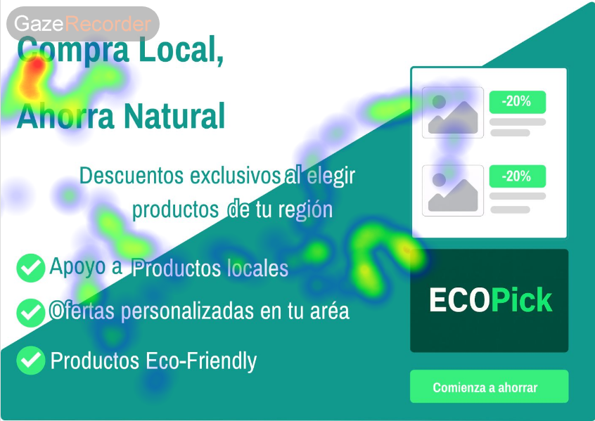

# DIU - Practica 4, entregables

- Users. Elección y características de los usuarios reclutados

  | id.usuario | Sexo/edad | Ocupación | Experiencia internet  | Plataforma | Perfil cubierto | Test | SUS score |
  | ---------- | --------- | --------- | --------------------  | ---------- | --------------- | ---- | --------- |
  |     01     |    M/22   | Estudiante Diseño    |      Intermedio       |   Móvil iOS  | Usuario ocasional | A | 80,0 |
  |     02     |    F/25   | Diseñador gráfico |         Avanzado           |    Desktop macOS   | Experto UI | A | 75,0 |
  |     03     |    M/35   | Contable  |       Bajo         |   Portátil Win  | Usuario poco hábil | A | 72,5 |
  |     04     |    M/40   | Profesor  |       Intermedio         |    Tablet Android   | Usuario ocasional | A | 85,0 |
  |     05     |    M/19   | Est. Ingeniería  |       Avanzado        |    Portátil Linux   | Usuario poco hábil | B | 70,0 |
  |     06     |    M/29   | Desarrollador web  |       Avanzado        |    Desktop Win   | Usuario experto | B | 68,0 |
  |     07     |    M/33   | Enfermera   |       Intermedio         |    Móvil Android   | Usuario poco hábil | B | 66,0 |
  |     08     |    M/46   | Comerciante  |       Bajo         |    Portátil Win   | Usuario poco hábil | B | 72,0 |

- Diseño de las pruebas
Se han diseñado una serie de pruebas en Maze para las aplicaciones de Ecogollo y Ecopick

  | Orden | Tarea | Criterio de éxito |
  | ---------- | --------- | --------- |
  |     1     |    Inicia sesión   | Pantalla "Sesion iniciada"    |
  |     2     |    Añade cualquier producto al carrito   | Carrito muestra 1 articulo |
  |     3     |    Accede al carrito y pulsa “Comprar”   | Pantalla Carrito  |
  |     4     |    Explora libremente la aplicación durante ~1 minuto   | "Finalizar"  |

Preguntas post-tarea:
1. ¿Te ha resultado clara la navegación?
Si/No

2. ¿Qué te ha parecido esta app?
Respuesta abierta

3. Describe esta app en una sola palabra.
Respuesta abierta

Instrucciones para participantes:
1. Entrar en el enlace de Maze: https://t.maze.co/391889958
2. Completar las 4 tareas que aparecerán en pantalla.
3. Responder a 3 preguntas rápidas de opinión.
4. Rellenar el cuestionario SUS

  | Prototipo | Puntuación tareas | Puntuación preguntas |
  | ---------- | --------- | --------- |
  |     A     |    73   | 77 |
  |     B     |    55   | 62 |

- Realización del Cuestionario SUS para usuarios y casos A y B.

  | Prototipo | Media SUS | Etiqueta SUS |
  | ---------- | --------- | --------- |
  |     A     |    78,1   | Excellent |
  |     B     |    69,0   | Good |

- Tabla A/B Testing con resultados para A y B

  | Test/Métrica | A | B | Ganadora |
  | ---------- | --------- | --------- | --------- |
  |     SUS     | 78,1 - Excellent | 69,0 - Good | A |
  |     Usability Checklist | 76 - Good | 70 - Good | A |
  |     Tareas Maze | 73 | 55 | A |
  |     Preguntas Maze | 77 | 62 | A |
  |     Media Total | 76,0 | 64 | A |

- Eye Tracking para B

.PNG)

%202.PNG)

- Usability Report del Caso B, con toda la información recabada del caso B

- Conclusiones

  Tras realizar las pruebas descritas anteriormente(SUS,usability checklist, tareas y preguntas A/B testing en Maze) a 8 usuarios(4 para cada proyecto), hemos concluido que el proyecto A tiene un trabajo mejor implementado respecto al proyecto B, con una media total de 76 para A y 64 para B, pero ambos necesitan mejorar para considerarse la aplicación mejor imaginable.

Conclusión para posible mejora en el proyecto B:
  El ojo humano en el eyetracking del proyecto B se decanta mucho por la zona izquierda, una posible mejora del proyecto sería poner los botones o acciones que más se deberían utilizar, o que más quieren que utilicen los usuarios, en esa zona de la página web.

>>>> Este fichero se debe editar para que cada evidencia quede enlazada con el recurso subido a la carpeta de la practica. Se pide más detalle técnico en las descripciones de lo que sería el README principal del repositorio y que corresponde a la descripcion del Case Study.
>>>> Termine con la seccion de Conclusiones para aportar una valoración final del equipo sobre la propia realización de la práctica
