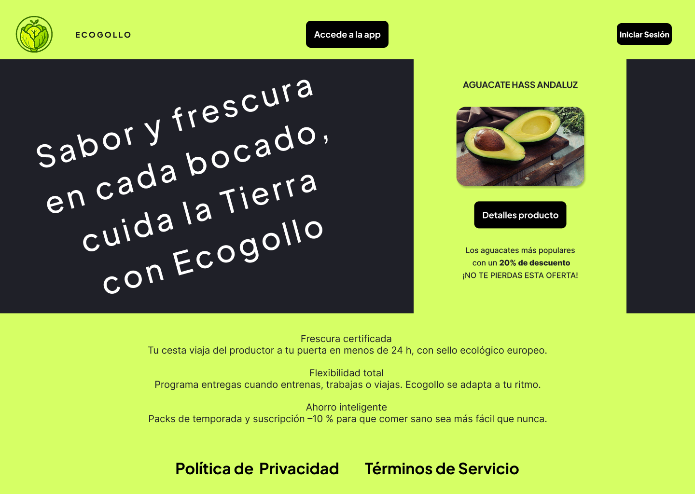
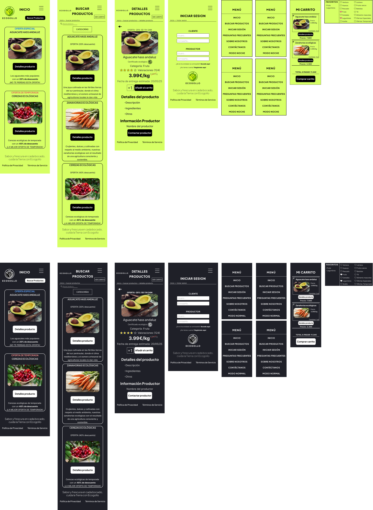

# DIU25
Prácticas Diseño Interfaces de Usuario (Tema: Mercados ecológicos ) 

[Guiones de prácticas](GuionesPracticas/)

Grupo: DIU1_SMJV.  Curso: 2024/25 

Actualizado: 28/05/2025

Proyecto: 

ECOGOLLO

Descripción: 

ECOGOLLO se trata de una aplicación móvil que busca mejorar la experiencia tanto de productores como de consumidores de productos ecológicos en cuanto a la compra, venta, distribución y entrega de productos, además de hacer mucho más amena la forma en la que se trabaja con la aplicación.

Logotipo: 

  

Eslogan: **"Sabor y frescura en cada bocado, cuida la Tierra con Ecogollo"**

Miembros:
 * :bust_in_silhouette:  Sergio Medina     :octocat: [@sergiomedi](https://github.com/sergiomedi)
 * :bust_in_silhouette:  Javier Ruiz de Valdivia     :octocat: [@Javito115](https://github.com/Javito115)

----- 

# Proceso de Diseño 

 

## Paso 1. UX User & Desk Research & Analisis 
### 1.a User Reseach Plan
 
-----

El User Research Plan tiene como objetivo comprender mejor las necesidades, motivaciones y barreras de los usuarios y proveedores del mercado ecológico.
Para ello se han tratado los siguientes puntos: **Background**, **Objetivos**, **Research Methods**, **Research Scope & Focus Areas** y **Participant Recruiting**
Para ver todo esto en detalle puedes acceder al pdf con toda la información [aquí](P1/User%20Research%20y%20An%C3%A1lisis%20de%20Competencia.pdf).

### 1.b Competitive Analysis
 
-----

Se han observado varias webs de compra y venta de productos ecológicos, de entre ellas se han seleccionado las 4 siguientes: Ecomercado de Granada, Valle y Vega, Agroboca y Farmdrop. De entre estas 4 hemos elegido Agroboca por ser la que más similitudes tiene con la idea que queremos implementa. Aun así, encontramos fallos en la visibilidad del contenido, en la devolución de productos y en la comunicación con el productor, lo que nos ayudó a enfocar nuestro diseño.

Para acceder al análisis competitivo al completo pulse [aquí](P1/Competitor%20Analysis.png).

### 1.c Personas
 
-----

Para las personas nos hemos enfocado en construir dos perfiles bastante distintos tanto en su forma de vida como en sus objetivos.
La primera persona sería Elena Gutierrez, una chica que se dedica al baloncesto en cuerpo y alma cuya obsesión la ha llevado a cuidar su dieta de forma tan estricta que hace que, en su mayoría, solo consuma productos ecológicos para poder mantener su rendimiento al 100%.

Elena Gutierrez
  

La segunda persona de la que vamos a hablar es Jaime Mellado, el cual centra su vida en su negocio, el cual es un restaurante familiar que quiere modernizar incluyendo en su menú opciones ecológicas.

Jaime Mellado
  

### 1.d User Journey Map
 
----

Hemos trabajado con dos escenarios de usuario distintos para representar problemas reales que podrían surgir en el uso de plataformas de productos ecológicos. Las experiencias seleccionadas están inspiradas en situaciones frecuentes dentro del sector: la necesidad de cancelar un pedido y la búsqueda de proveedores fiables para un negocio. Ambas reflejan frustraciones comunes y oportunidades claras de mejora.

Journey Map - Elena Gutierrez
  

- Elena es una joven de 22 años que, tras hacer un pedido, necesita cancelarlo por una urgencia médica.
- Su experiencia está marcada por la confusión, la falta de un proceso claro de cancelación y la necesidad de contactar manualmente con el productor sin éxito.
- Esta situación refleja un problema habitual en muchas plataformas: la ausencia de un flujo simple y automatizado para gestionar cancelaciones, lo que lleva a una gran insatisfacción y pérdida de confianza.
- Aquí detectamos oportunidades como automatizar la gestión de pedidos, mejorar la información desde el correo de confirmación, y asegurar políticas más flexibles.

Journey Map - Jaime Mellado
  

- Jaime es un empresario de 45 años que busca introducir productos ecológicos en su restaurante.
- A lo largo de su experiencia, se enfrenta a una falta de claridad para contactar con productores reales, pruebas de calidad insuficientes y dudas sobre la continuidad del suministro.
- Su frustración se reduce cuando encuentra un proveedor adecuado, pero el proceso hasta llegar a esa conclusión es largo e incierto.
- Esta experiencia muestra la necesidad de una plataforma que conecte directamente a restaurantes y productores, que ofrezca pruebas accesibles y que garantice la fiabilidad a largo plazo.

### 1.e Usability Review
 
----

La evaluación de usabilidad realizada sobre Agroboca revela que la plataforma cumple de forma aceptable los objetivos principales del usuario, como comprar y vender productos ecológicos.
Entre los puntos fuertes destacan:

 - "Buen rendimiento general del sitio".
 - "Accesos rápidos y visibles desde la página principal".
 - "Compatibilidad con dispositivos y navegadores".
 - "Sistema de búsqueda funcional aunque limitado".

Sin embargo, se detectaron varios puntos débiles:
 - "Ausencia de guía para usuarios nuevos".
 - "Procesos poco divididos o estructurados en formularios".
 - "Falta de accesibilidad visual (contraste y tipografía)".
 - "Experiencia pobre para la ayuda al usuario".

- Enlace al documento: [Usability Review](P1/Usability-review-agroboca.pdf)
- Web evaluada: [Agroboca](https://www.agroboca.com/)
- Valoración obtenida: **67/100**

 

## Paso 2. UX Design  

### 2.a Reframing / IDEACION: Feedback Capture Grid / EMpathy map 
 
----

Tras ver otras webs del sector, lo que más falla es la devolución del pedido y el contacto cliente/productor, aparte de que no son sencillas a la vista de los usuarios ni dan recompensas por comprar en su web.
 
Para acceder al feedback capture grid y empathy map: [accede desde aquí.](P2/README.md/#ideación)

 Interesante | Críticas     
| ------------- | -------
  Preguntas | Nuevas ideas
  
    
Proponemos desarrollar una página web para la venta/compra de productos ecológicos. Esta web te dejará crear una cuenta como comprador y otra cuenta como productor si lo que deseas es vender, el usuario tendrá un apartado llamado Mi Cuenta para editar su perfil, ver su historial de compras, sus pedidos en curso y valorar los productos comprados y sus productores, a la vez que puede hacer devoluciones y contactar con el productor de un producto en específico, poodrá crear y editar su carrito de la compra con productos que encuentre en el buscador, en el propio buscador podrá elegir la búsqueda por categorías, dejando a su vez añadir a favoritos las categorías que prefiera. El productor podrá añadir nuevos productos y gestionarlos. (Dar recompensas por comprar en la web es una implementación a futuro, de momento queremos centrarnos en las funciones necesarias para la página web)

### 2.b ScopeCanvas

----

Propuesta de valor con ScopeCanvas, [accede desde aquí.](P2/README.md/#propuesta-de-valor)

### 2.b User Flow (task) analysis 
 
-----

Hemos hecho un Task Matrix con las tareas que tiene nuestra página web para visitante, usuario registrado, productor y administrador, ordenadas de mayor a menor peso según el uso estimado que le va a dar cad tipo de usuario.

Hemos hecho un User Flow con el orden de tareas que pensamos que van a ser más comunes entre los distintos usuarios.

Para saber más [accede desde aquí.](P2/README.md/#task-analysis)

### 2.c IA: Sitemap + Labelling 
 
----

Hemos creado un Sitemap global con una leyenda para saber por dónde navega cada tipo de usuario según las tareas del User Flow especificado anteriormente, seguidamente añadido un Labelling con una breve descripción para saber de qué va cada página.

Para saber más [accede desde aquí.](P2/README.md/#arquitectura-de-información)

Término | Significado     
| ------------- | -------
  Login  | acceder a plataforma

### 2.d Wireframes
 
-----

Hemos planteado un diseño minimalista para la creación de las 3 páginas que consideramos más importantes en común con el visitante y usuario registrado.

Hemos utilizado Figma para crear tanto el modelo de web, como el de tablet y móvil.

Para saber más [accede desde aquí.](P2/README.md/#prototipo-lo-fi-wireframe)

 

## Paso 3. Mi UX-Case Study (diseño)

Cansados de buscar sin éxito una plataforma ecológica clara, útil y práctica decidimos crear **ECOGOLLO**: una web donde comprar y vender productos ecológicos sea un proceso fácil, transparente y accesible para todos.
Tras explorar distintas plataformas del mercado ecológico, nos dimos cuenta de que muchas eran confusas, poco accesibles o no ofrecían una comunicación directa con el productor. Algunas no facilitaban devoluciones, otras no transmitían confianza ni claridad en los productos ofertados.
Esto nos impulsó a diseñar **ECOGOLLO**, una aplicación que va más allá del simple marketplace: una experiencia pensada para cuidar tanto del planeta como del usuario.
Con una interfaz accesible, opciones claras para comprar, vender o devolver productos, y una apuesta futura por la personalización y recompensas para el usuario, **ECOGOLLO** nace como un entorno amigable, responsable y justo para todos los actores del ecosistema ecológico.

### 3.a Moodboard

-----

Para el moodboard de Ecogollo queríamos transmitir frescura, accesibilidad y confianza, buscando una estética visual que reflejara los valores del consumo responsable y el compromiso ecológico.
Nos planteamos: ¿Qué hace que un usuario confíe en una tienda ecológica online? ¿Cómo podemos crear una experiencia visual que resulte clara, coherente y accesible para cualquier tipo de usuario?
Inspirados por entornos naturales y productos reales del mercado ecológico, construimos una paleta de colores que reflejara esa cercanía y limpieza:
 - En modo claro: verde lima (#D6FF65) como color principal, combinado con un gris azulado oscuro (#1F2028).
 - En modo oscuro: inversión de esos tonos con ajustes de contraste para mejor accesibilidad.
Seleccionamos las tipografías Inter (para cuerpo de texto) y Plus Jakarta Sans (para títulos) por su excelente legibilidad y estilo moderno. También definimos dos variantes visuales (modo claro y nocturno) para adaptarse al entorno de cada usuario.

Para acceder al Moodboard completo pulse [aquí.](P3/readme.md#moodboard-diseño-visual--logotipo)

### 3.b Landing Page
 
----

Para diseñar la Landing Page nos guiamos por el moodboard y las directrices visuales que ya habíamos definido. Queríamos que esta primera pantalla fuera directa y visualmente clara.
Con solo un vistazo, el usuario debe entender que Ecogollo es una plataforma para comprar y vender productos ecológicos.

Para acceder a la Landing Page pulse [aquí.](P3/readme.md#landing-page)

### 3.c Guidelines
 
----

A partir del análisis de patrones de diseño y referencias de buenas prácticas, definimos unas guidelines específicas para Ecogollo que garantizan una experiencia clara, visualmente coherente y funcional en todas las plataformas.

Estas son las principales decisiones tomadas:
- Onboarding: La pantalla de inicio introduce al usuario de forma directa con promociones destacadas y el slogan “Sabor y frescura en cada bocado, cuida la Tierra con Ecogollo”, con CTA claro al catálogo.
- Menú hamburguesa adaptado a móvil: Accesible desde cualquier página, con enlaces directos a secciones clave (Inicio, Buscar productos, FAQs, Contacto...) y un interruptor para modo oscuro.
- Sistema de búsqueda y filtrado: Incorporamos una barra de búsqueda junto a un desplegable de categorías para facilitar el acceso a los productos según el tipo (frutas, verduras, etc.), con resultados en tarjetas visuales.
- Diseño de productos en formato tarjeta: En las vistas de catálogo, los productos se presentan verticalmente con imagen, descripción, precio y botón de acción claro.
- Ficha de producto detallada: Contiene toda la información relevante: imagen, precio, ingredientes, productor y opción directa de contacto. Permite seleccionar cantidad y añadir al carrito con un solo clic.
- Carrito: Siempre accesible sin salir de la navegación. Resume productos añadidos, cantidades, total, y permite editar o eliminar artículos de forma intuitiva.
- Formulario de inicio de sesión: Diferenciado por tipo de usuario (cliente o productor), con enlaces a recuperación de contraseña y registro. El acceso de administrador queda oculto y restringido.
Footer: Presente en todas las pantallas, con enlaces a Política de Privacidad y Términos de Servicio, en formato discreto y claro.

Para acceder a las Guidelines pulse [aquí.](P3/readme.md#guidelines)

### 3.d Mockup
 
----

Para representar visualmente la experiencia de usuario de Ecogollo, hemos desarrollado un prototipo de alta fidelidad (HI-FI) compuesto por 14 pantallas, divididas entre modo claro y modo noche, accesibles desde el menú de navegación.
El mockup simula tareas clave como:
- Navegar por categorías
- Buscar productos
- Ver detalles y añadir al carrito
- Iniciar sesión como cliente o productor

Todas las páginas incluyen interacciones reales y una navegación coherente. El modo noche ha sido diseñado también pensando en personas con sensibilidad visual o daltonismo.

Vista Previa

Para acceder al Mockup pulse [aquí.](P3/readme.md#mockup-layout-hi-fi)

### 3.e ¿My UX-Case Study?
 
-----

A lo largo de la práctica hemos ido plasmando todo el desarrollo de nuestra aplicación y ha quedado definido en nuestro Case Study.

Para acceder al Case Study pulse [aquí.](P3/readme.md#publicación-del-case-study)

 

## Paso 4. Pruebas de Evaluación 

### 4.a Reclutamiento de usuarios 

-----

Se nos ha asignado como Caso-B el proyecto Ecopick, el cual trata sobre una aplicación de venta de productos ecológicas al igual que nuestro proyecto Ecogollo, que será el Caso-A.
Para acceder al proyecto Caso-B pulse [aquí.](https://github.com/VictorNievas/UX_CaseStudy)

Hemos contemplado 8 usuarios de distintas edades, ocupaciones, experiencias y plataformas. 4 usuarios serán asignados al Caso-A y los 4 restantes al Caso-B.

  | id.usuario | Sexo/edad | Ocupación | Experiencia internet  | Plataforma | Perfil cubierto | Test | SUS score |
  | ---------- | --------- | --------- | --------------------  | ---------- | --------------- | ---- | --------- |
  |     01     |    M/22   | Estudiante Diseño    |      Intermedio       |   Móvil iOS  | Usuario ocasional | A | 80,0 |
  |     02     |    F/25   | Diseñador gráfico |         Avanzado           |    Desktop macOS   | Experto UI | A | 75,0 |
  |     03     |    M/35   | Contable  |       Bajo         |   Portátil Win  | Usuario poco hábil | A | 72,5 |
  |     04     |    M/40   | Profesor  |       Intermedio         |    Tablet Android   | Usuario ocasional | A | 85,0 |
  |     05     |    M/19   | Est. Ingeniería  |       Avanzado        |    Portátil Linux   | Usuario poco hábil | B | 70,0 |
  |     06     |    M/29   | Desarrollador web  |       Avanzado        |    Desktop Win   | Usuario experto | B | 68,0 |
  |     07     |    M/33   | Enfermera   |       Intermedio         |    Móvil Android   | Usuario poco hábil | B | 66,0 |
  |     08     |    M/46   | Comerciante  |       Bajo         |    Portátil Win   | Usuario poco hábil | B | 72,0 |

### 4.b Diseño de las pruebas 
 
-----

Se han diseñado una serie de pruebas en Maze para las aplicaciones de Ecogollo(Caso-A) y Ecopick(Caso-B)

  | Orden | Tarea | Criterio de éxito |
  | ---------- | --------- | --------- |
  |     1     |    Inicia sesión   | Pantalla "Sesion iniciada"    |
  |     2     |    Añade cualquier producto al carrito   | Carrito muestra 1 articulo |
  |     3     |    Accede al carrito y pulsa “Comprar”   | Pantalla Carrito  |
  |     4     |    Explora libremente la aplicación durante ~1 minuto   | "Finalizar"  |

Preguntas post-tarea:
1. ¿Te ha resultado clara la navegación?
Si/No

2. ¿Qué te ha parecido esta app?
Respuesta abierta

3. Describe esta app en una sola palabra.
Respuesta abierta

Instrucciones para participantes:
1. Entrar en el enlace de Maze: https://t.maze.co/391889958
2. Completar las 4 tareas que aparecerán en pantalla.
3. Responder a 3 preguntas rápidas de opinión.
4. Rellenar el cuestionario SUS

Puntuación total recogida:

  | Prototipo | Puntuación tareas | Puntuación preguntas |
  | ---------- | --------- | --------- |
  |     A     |    73   | 77 |
  |     B     |    55   | 62 |

  Adicionalmente se ha realizado el usability checklist de la P1 para ambos casos.

### 4.c Cuestionario SUS
 
----
Tras la realización del cuestionario SUS a los usuarios descritos anteriormente, se ha recogido el resultado total para ambos casos:

 | Prototipo | Media SUS | Etiqueta SUS |
  | ---------- | --------- | --------- |
  |     A     |    78,1   | Excellent |
  |     B     |    69,0   | Good |

### 4.d A/B Testing
 
-----

Resultados de todos los test usados para ambos casos:

| Test/Métrica | A | B | Ganadora |
  | ---------- | --------- | --------- | --------- |
  |     SUS     | 78,1 - Excellent | 69,0 - Good | A |
  |     Usability Checklist | 76 - Good | 70 - Good | A |
  |     Tareas Maze | 73 | 55 | A |
  |     Preguntas Maze | 77 | 62 | A |
  |     Media Total | 76,0 | 64 | A |

  Tras realizar la media total, nos da como resultado que el Caso-A tiene una mejor usabilidad que el Caso-B.

### 4.e Aplicación del método Eye Tracking 

----

Este experimento solo lo hemos realizado para el Caso-B, hemos hecho uso de gazerecorder.com entregando capturas de cada página web del Caso-B y los usuarios han hecho uso de ellas para captar a dónde se dirige el ojo humano.

.PNG)

%202.PNG)
 

### 4.f Usability Report de B
 
-----

Para acceder al usability report de B pulse [aquí.](P4/Usability-Report-template.md)

 

## Conclusiones finales & Valoración de las prácticas

Ecogollo demuestra que una plataforma ecológica puede ser clara, accesible y fiable tanto para consumidores como para productores.
La investigación con usuarios y la iteración del diseño se traducen en un 78/100 de usabilidad, superando a referencias del sector y validando nuestras decisiones.
El prototipo ofrece una identidad visual coherente, flujos de compra fluidos y canales de devolución y contacto que resuelven los principales puntos de dolor detectados.
Para la siguiente etapa necesitamos ampliar la muestra de pruebas, afinar la logística e implantar el sistema de recompensas para reforzar aún más la propuesta de valor.

