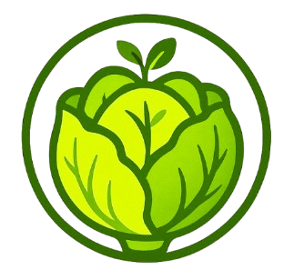
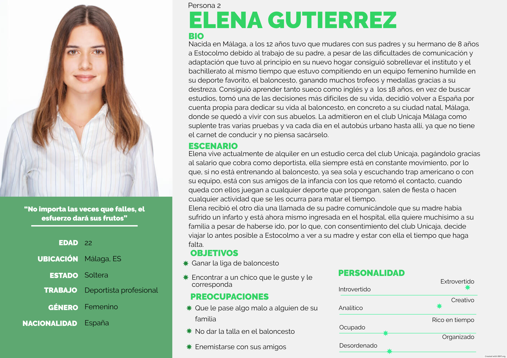
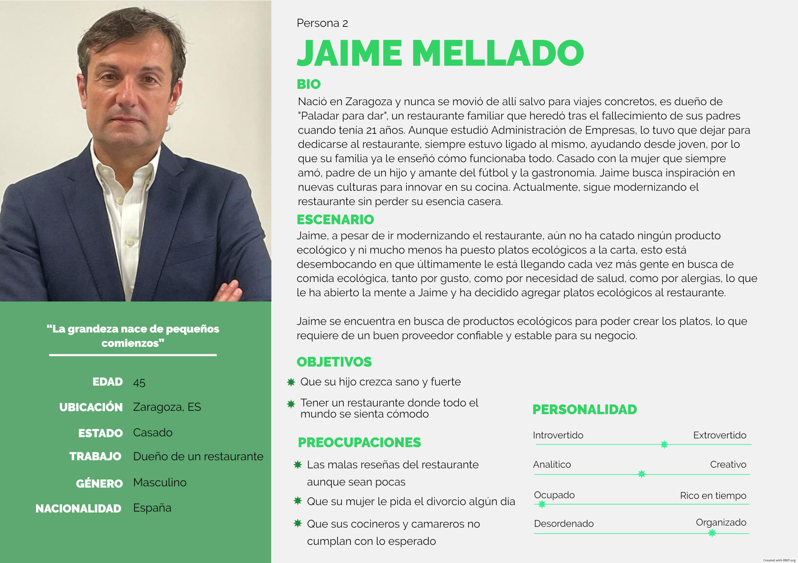
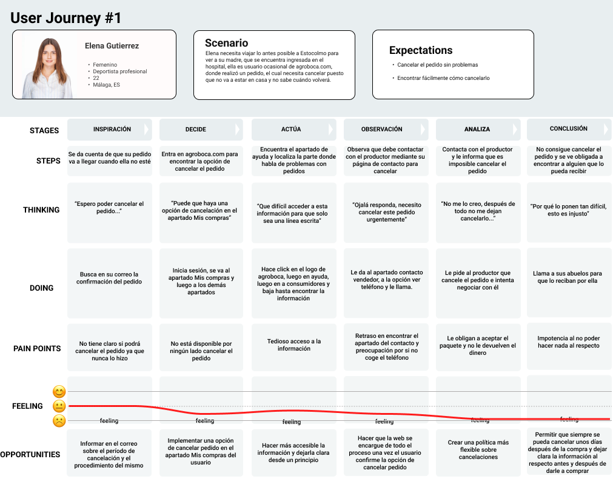
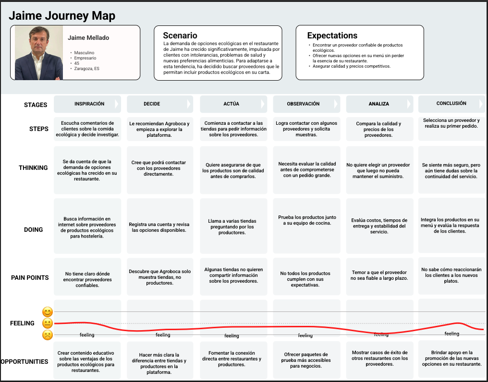

# DIU25
Prácticas Diseño Interfaces de Usuario (Tema: Mercados ecológicos ) 

[Guiones de prácticas](GuionesPracticas/)

Grupo: DIU1_SMJV.  Curso: 2024/25 

Actualizado: 08/05/2025

Proyecto: 

ECOGOLLO

Descripción: 

ECOGOLLO se trata de una aplicación móvil que busca mejorar la experiencia tanto de productores como de consumidores de productos ecológicos en cuanto a la compra, venta, distribución y entrega de productos, además de hacer mucho más amena la forma en la que se trabaja con la aplicación.

Logotipo: 

  

Eslogan: **"Sabor y frescura en cada bocado, cuida la Tierra con Ecogollo"**

Miembros:
 * :bust_in_silhouette:  Sergio Medina     :octocat: [@sergiomedi](https://github.com/sergiomedi)
 * :bust_in_silhouette:  Javier Ruiz de Valdivia     :octocat: [@Javito115](https://github.com/Javito115)

----- 

# Proceso de Diseño 

 

## Paso 1. UX User & Desk Research & Analisis 
### 1.a User Reseach Plan
 
-----

El User Research Plan tiene como objetivo comprender mejor las necesidades, motivaciones y barreras de los usuarios y proveedores del mercado ecológico.
Para ello se han tratado los siguientes puntos: **Background**, **Objetivos**, **Research Methods**, **Research Scope & Focus Areas** y **Participant Recruiting**
Para ver todo esto en detalle puedes acceder al pdf con toda la información [aquí](P1/User%20Research%20y%20An%C3%A1lisis%20de%20Competencia.pdf).

### 1.b Competitive Analysis
 
-----

Se han observado varias webs de compra y venta de productos ecológicos, de entre ellas se han seleccionado las 4 siguientes: Ecomercado de Granada, Valle y Vega, Agroboca y Farmdrop. De entre estas 4 hemos elegido Agroboca por ser la que más similitudes tiene con la idea que queremos implementa. Aun así, encontramos fallos en la visibilidad del contenido, en la devolución de productos y en la comunicación con el productor, lo que nos ayudó a enfocar nuestro diseño.

Para acceder al análisis competitivo al completo pulse [aquí](P1/Competitor%20Analysis.png).

### 1.c Personas
 
-----

Para las personas nos hemos enfocado en construir dos perfiles bastante distintos tanto en su forma de vida como en sus objetivos.
La primera persona sería Elena Gutierrez, una chica que se dedica al baloncesto en cuerpo y alma cuya obsesión la ha llevado a cuidar su dieta de forma tan estricta que hace que, en su mayoría, solo consuma productos ecológicos para poder mantener su rendimiento al 100%.

Elena Gutierrez
  

La segunda persona de la que vamos a hablar es Jaime Mellado, el cual centra su vida en su negocio, el cual es un restaurante familiar que quiere modernizar incluyendo en su menú opciones ecológicas.

Jaime Mellado
  

### 1.d User Journey Map
 
----

Hemos trabajado con dos escenarios de usuario distintos para representar problemas reales que podrían surgir en el uso de plataformas de productos ecológicos. Las experiencias seleccionadas están inspiradas en situaciones frecuentes dentro del sector: la necesidad de cancelar un pedido y la búsqueda de proveedores fiables para un negocio. Ambas reflejan frustraciones comunes y oportunidades claras de mejora.

Journey Map - Elena Gutierrez
  

- Elena es una joven de 22 años que, tras hacer un pedido, necesita cancelarlo por una urgencia médica.
- Su experiencia está marcada por la confusión, la falta de un proceso claro de cancelación y la necesidad de contactar manualmente con el productor sin éxito.
- Esta situación refleja un problema habitual en muchas plataformas: la ausencia de un flujo simple y automatizado para gestionar cancelaciones, lo que lleva a una gran insatisfacción y pérdida de confianza.
- Aquí detectamos oportunidades como automatizar la gestión de pedidos, mejorar la información desde el correo de confirmación, y asegurar políticas más flexibles.

Journey Map - Jaime Mellado
  

- Jaime es un empresario de 45 años que busca introducir productos ecológicos en su restaurante.
- A lo largo de su experiencia, se enfrenta a una falta de claridad para contactar con productores reales, pruebas de calidad insuficientes y dudas sobre la continuidad del suministro.
- Su frustración se reduce cuando encuentra un proveedor adecuado, pero el proceso hasta llegar a esa conclusión es largo e incierto.
- Esta experiencia muestra la necesidad de una plataforma que conecte directamente a restaurantes y productores, que ofrezca pruebas accesibles y que garantice la fiabilidad a largo plazo.

### 1.e Usability Review
 
----

La evaluación de usabilidad realizada sobre Agroboca revela que la plataforma cumple de forma aceptable los objetivos principales del usuario, como comprar y vender productos ecológicos.
Entre los puntos fuertes destacan:

 - "Buen rendimiento general del sitio".
 - "Accesos rápidos y visibles desde la página principal".
 - "Compatibilidad con dispositivos y navegadores".
 - "Sistema de búsqueda funcional aunque limitado".

Sin embargo, se detectaron varios puntos débiles:
 - "Ausencia de guía para usuarios nuevos".
 - "Procesos poco divididos o estructurados en formularios".
 - "Falta de accesibilidad visual (contraste y tipografía)".
 - "Experiencia pobre para la ayuda al usuario".

- Enlace al documento: [Usability Review](P1/Usability-review-agroboca.pdf)
- Web evaluada: [Agroboca](https://www.agroboca.com/)
- Valoración obtenida: **67/100**

 

## Paso 2. UX Design  

### 2.a Reframing / IDEACION: Feedback Capture Grid / EMpathy map 
 
----

Tras ver otras webs del sector, lo que más falla es la devolución del pedido y el contacto cliente/productor, aparte de que no son sencillas a la vista de los usuarios ni dan recompensas por comprar en su web.
 
Para acceder al feedback capture grid y empathy map: [accede desde aquí.](P2/README.md/#ideación)

 Interesante | Críticas     
| ------------- | -------
  Preguntas | Nuevas ideas
  
    
Proponemos desarrollar una página web para la venta/compra de productos ecológicos. Esta web te dejará crear una cuenta como comprador y otra cuenta como productor si lo que deseas es vender, el usuario tendrá un apartado llamado Mi Cuenta para editar su perfil, ver su historial de compras, sus pedidos en curso y valorar los productos comprados y sus productores, a la vez que puede hacer devoluciones y contactar con el productor de un producto en específico, poodrá crear y editar su carrito de la compra con productos que encuentre en el buscador, en el propio buscador podrá elegir la búsqueda por categorías, dejando a su vez añadir a favoritos las categorías que prefiera. El productor podrá añadir nuevos productos y gestionarlos. (Dar recompensas por comprar en la web es una implementación a futuro, de momento queremos centrarnos en las funciones necesarias para la página web)

### 2.b ScopeCanvas

----

Propuesta de valor con ScopeCanvas, [accede desde aquí.](P2/README.md/#propuesta-de-valor)

### 2.b User Flow (task) analysis 
 
-----

Hemos hecho un Task Matrix con las tareas que tiene nuestra página web para visitante, usuario registrado, productor y administrador, ordenadas de mayor a menor peso según el uso estimado que le va a dar cad tipo de usuario.

Hemos hecho un User Flow con el orden de tareas que pensamos que van a ser más comunes entre los distintos usuarios.

Para saber más [accede desde aquí.](P2/README.md/#task-analysis)

### 2.c IA: Sitemap + Labelling 
 
----

Hemos creado un Sitemap global con una leyenda para saber por dónde navega cada tipo de usuario según las tareas del User Flow especificado anteriormente, seguidamente añadido un Labelling con una breve descripción para saber de qué va cada página.

Para saber más [accede desde aquí.](P2/README.md/#arquitectura-de-información)

Término | Significado     
| ------------- | -------
  Login  | acceder a plataforma

### 2.d Wireframes
 
-----

Hemos planteado un diseño minimalista para la creación de las 3 páginas que consideramos más importantes en común con el visitante y usuario registrado.

Hemos utilizado Figma para crear tanto el modelo de web, como el de tablet y móvil.

Para saber más [accede desde aquí.](P2/README.md/#prototipo-lo-fi-wireframe)

 

## Paso 3. Mi UX-Case Study (diseño)

>>> Cualquier título puede ser adaptado. Recuerda borrar estos comentarios del template en tu documento

### 3.a Moodboard

-----

>>> Diseño visual con una guía de estilos visual (moodboard) 
>>> Incluir Logotipo. Todos los recursos estarán subidos a la carpeta P3/
>>> Explique aqui la/s herramienta/s utilizada/s y el por qué de la resolución empleada. Reflexione ¿Se puede usar esta imagen como cabecera de Instagram, por ejemplo, o se necesitan otras?

### 3.b Landing Page
 
----

>>> Plantear el Landing Page del producto. Aplica estilos definidos en el moodboard

### 3.c Guidelines
 
----

>>> Estudio de Guidelines y explicación de los Patrones IU a usar 
>>> Es decir, tras documentarse, muestre las deciones tomadas sobre Patrones IU a usar para la fase siguiente de prototipado. 

### 3.d Mockup
 
----

>>> Consiste en tener un Layout en acción. Un Mockup es un prototipo HTML que permite simular tareas con estilo de IU seleccionado. Muy útil para compartir con stakeholders

### 3.e ¿My UX-Case Study?
 
-----

>>> Publicar my Case Study en Github... Es el momento de dejar este documento para que sea evaluado y calificado como parte de la práctica
>>> Documente bien la cabecera y asegurese que ha resumido los pasos realizados para el diseño de su producto

 

## Paso 4. Pruebas de Evaluación 

### 4.a Reclutamiento de usuarios 

-----

>>> Breve descripción del caso asignado (llamado Caso-B) con enlace al repositorio Github
>>> Tabla y asignación de personas ficticias (o reales) a las pruebas. Exprese las ideas de posibles situaciones conflictivas de esa persona en las propuestas evaluadas. Mínimo 4 usuarios: asigne 2 al Caso A y 2 al caso B.

| Usuarios | Sexo/Edad     | Ocupación   |  Exp.TIC    | Personalidad | Plataforma | Caso
| ------------- | -------- | ----------- | ----------- | -----------  | ---------- | ----
| User1's name  | H / 18   | Estudiante  | Media       | Introvertido | Web.       | A 
| User2's name  | H / 18   | Estudiante  | Media       | Timido       | Web        | A 
| User3's name  | M / 35   | Abogado     | Baja        | Emocional    | móvil      | B 
| User4's name  | H / 18   | Estudiante  | Media       | Racional     | Web        | B 

### 4.b Diseño de las pruebas 
 
-----

>>> Planifique qué pruebas se van a desarrollar. ¿En qué consisten? ¿Se hará uso del checklist de la P1?

### 4.c Cuestionario SUS
 
----

>>> Como uno de los test para la prueba A/B testing, usaremos el **Cuestionario SUS** que permite valorar la satisfacción de cada usuario con el diseño utilizado (casos A o B). Para calcular la valoración numérica y la etiqueta linguistica resultante usamos la [hoja de cálculo](https://github.com/mgea/DIU19/blob/master/Cuestionario%20SUS%20DIU.xlsx). Previamente conozca en qué consiste la escala SUS y cómo se interpretan sus resultados
http://usabilitygeek.com/how-to-use-the-system-usability-scale-sus-to-evaluate-the-usability-of-your-website/)
Para más información, consultar aquí sobre la [metodología SUS](https://cui.unige.ch/isi/icle-wiki/_media/ipm:test-suschapt.pdf)
>>> Adjuntar en la carpeta P4/ el excel resultante y describa aquí la valoración personal de los resultados 

### 4.d A/B Testing
 
-----

>>> Los resultados de un A/B testing con 3 pruebas y 2 casos o alternativas daría como resultado una tabla de 3 filas y 2 columnas, además de un resultado agregado global. Especifique con claridad el resultado: qué caso es más usable, A o B?

### 4.e Aplicación del método Eye Tracking 

----

>>> Indica cómo se diseña el experimento y se reclutan los usuarios. Explica la herramienta / uso de gazerecorder.com u otra similar. Aplíquese únicamente al caso B.

  
>>> Cambiar esta img por una de vuestro experimento. El recurso deberá estar subido a la carpeta P4/  

>>> gazerecorder en versión de pruebas puede estar limitada a 3 usuarios para generar mapa de calor (crédito > 0 para que funcione) 

### 4.f Usability Report de B
 
-----

>>> Añadir report de usabilidad para práctica B (la de los compañeros) aportando resultados y valoración de cada debilidad de usabilidad. 
>>> Enlazar aqui con el archivo subido a P4/ que indica qué equipo evalua a qué otro equipo.

>>> Complementad el Case Study en su Paso 4 con una Valoración personal del equipo sobre esta tarea

 

## Paso 5. Exportación y Documentación 

### 5.a Exportación a HTML/React
 
----

>>> Breve descripción de esta tarea. Las evidencias de este paso quedan subidas a P5/

### 5.b Documentación con Storybook

----

>>> Breve descripción de esta tarea. Las evidencias de este paso quedan subidas a P5/

 

## Conclusiones finales & Valoración de las prácticas

>>> Opinión FINAL del proceso de desarrollo de diseño siguiendo metodología UX y valoración (positiva /negativa) de los resultados obtenidos. ¿Qué se puede mejorar? Recuerda que este tipo de texto se debe eliminar del template que se os proporciona 

